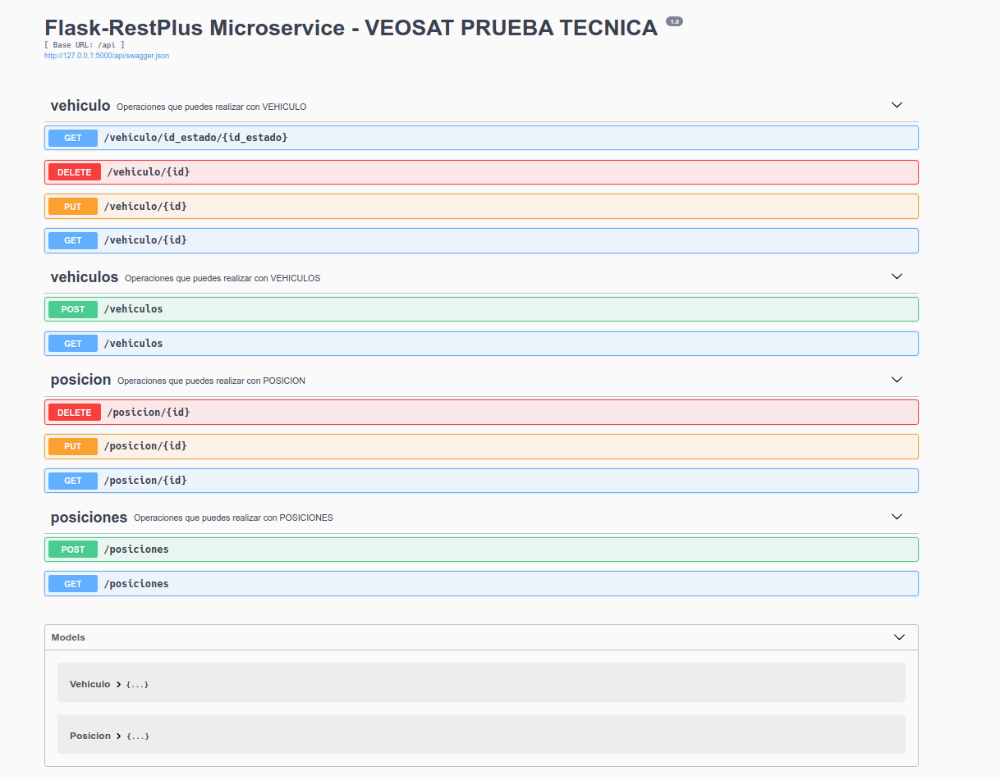
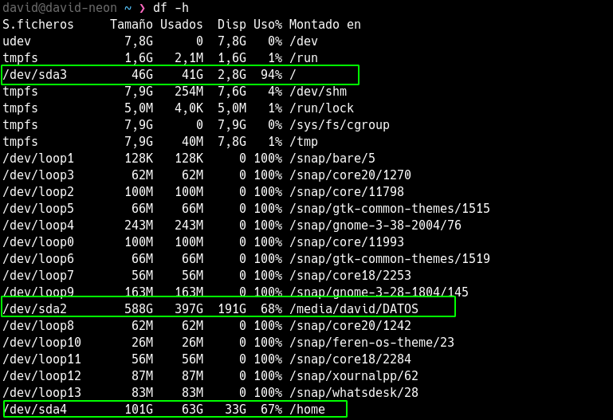
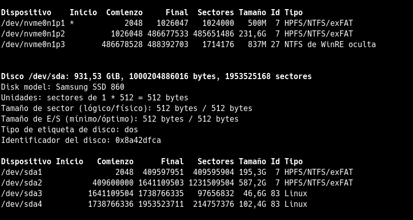
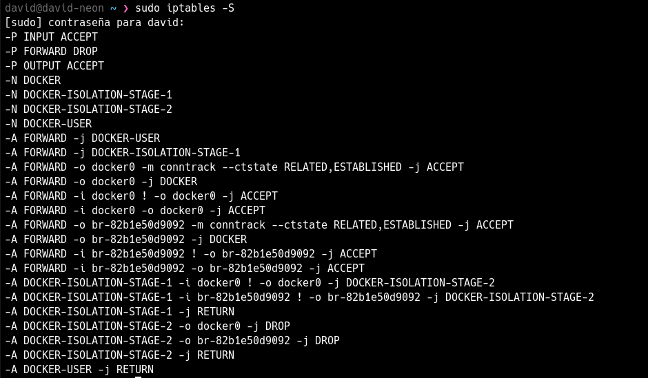
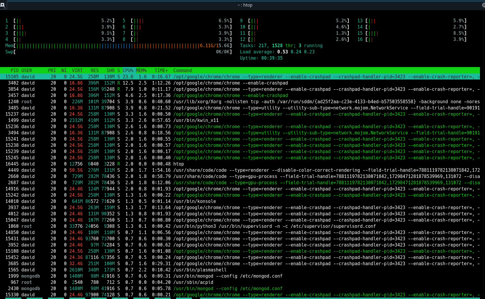
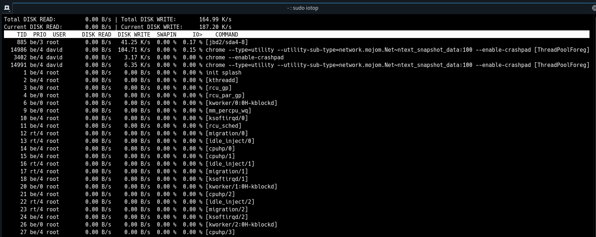
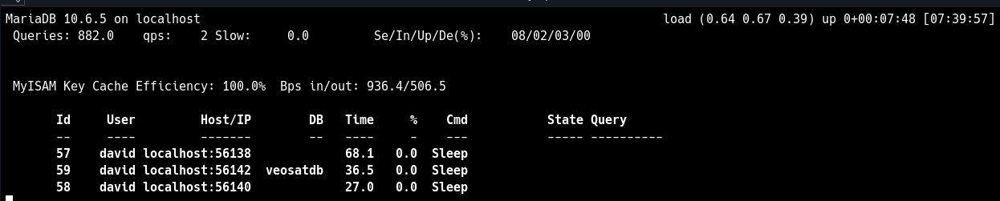

# VEOSAT: TEST DE CONOCIMIENTOS

- [VEOSAT: TEST DE CONOCIMIENTOS](#veosat-test-de-conocimientos)
- [Generar bbdd](#generar-bbdd)
- [Microservicio con Flask-RestPlus y SQLAlchemy](#microservicio-con-flask-restplus-y-sqlalchemy)
  - [Ejecución](#ejecución)
  - [Documentación API](#documentación-api)
  - [Paquetes del proyecto](#paquetes-del-proyecto)
- [Aplicativo Python](#aplicativo-python)
- [Comandos Linux](#comandos-linux)

# Generar bbdd

Ejecutar el script `veosatdb.sql`, éste generará:

1. Una bbdd con el nombre veosatdb
2. Tablas VEHICULOS y POSICIONES e insertará añgunos datos de prueba.
3. Trigger que se activa cada vez que hay una inserción en la tabla POSICIONES, si la nueva posición tiene una velocidad superior a 10 actualiza el estado del vehículo

# Microservicio con Flask-RestPlus y SQLAlchemy

El código se encuentra en el directorio `flask-restplus-app`

## Ejecución

0. Previamente ejecutar el script `veosatdb.sql` que se encuentra en el directorio raíz.

1. crear virtual environment `python3 -m ven venv_`
2. activar venv `source venv_/bin/activate`
3. intalar dependencias `pip install -r requirements.txt`
4. completar los datos de conexión en el archivo `connection_db.py`
5. correr server `python app.py`

> lo más adecuado sería guardar los datos de conexión como variables de entorno en el servidor

> rellenar los datos de conexión en el archivo connection.py 

## Documentación API 

[API-doc](http://127.0.0.1:5000/api/doc)

## Paquetes del proyecto

1. marshmallow, ORM que me permite simplificar el proceso de serialización
2. sqlAlchemy, libreria que nos facilita la comunicación entre python y la bbdd.
3. Swagger UI, generar documentación interactiva

# Aplicativo Python

El código se encuentra en el directorio `python`. Tiene dos funciones:

1. update_id_estado() -> básicamente lee las posiciones y actualiza el estado del VEHICULO
2. save_data_in_dict() -> lee la bbdd y guarda los datos en un diccionario.

> ejecutar el archivo requirements.txt para instalar mysql-connector.

> rellenar los datos de conexión en el archivo connection.py 

# Comandos Linux 

1. Conocer espacio en disco podemos usar `df -ha` o `fdisk -l`

1. iptables - listar las reglas del firewall

4. estadísticas del servidor

    1. listado de procesos en el server y carga de los diferentes nucleos podemos usar HTOP
        
    2. sacar estadísticas de lectura y escritura del disco podemos usar IOTOP
        
    3. Estadísticas en tiempo real de uso de MySQL con MYTOP
        

