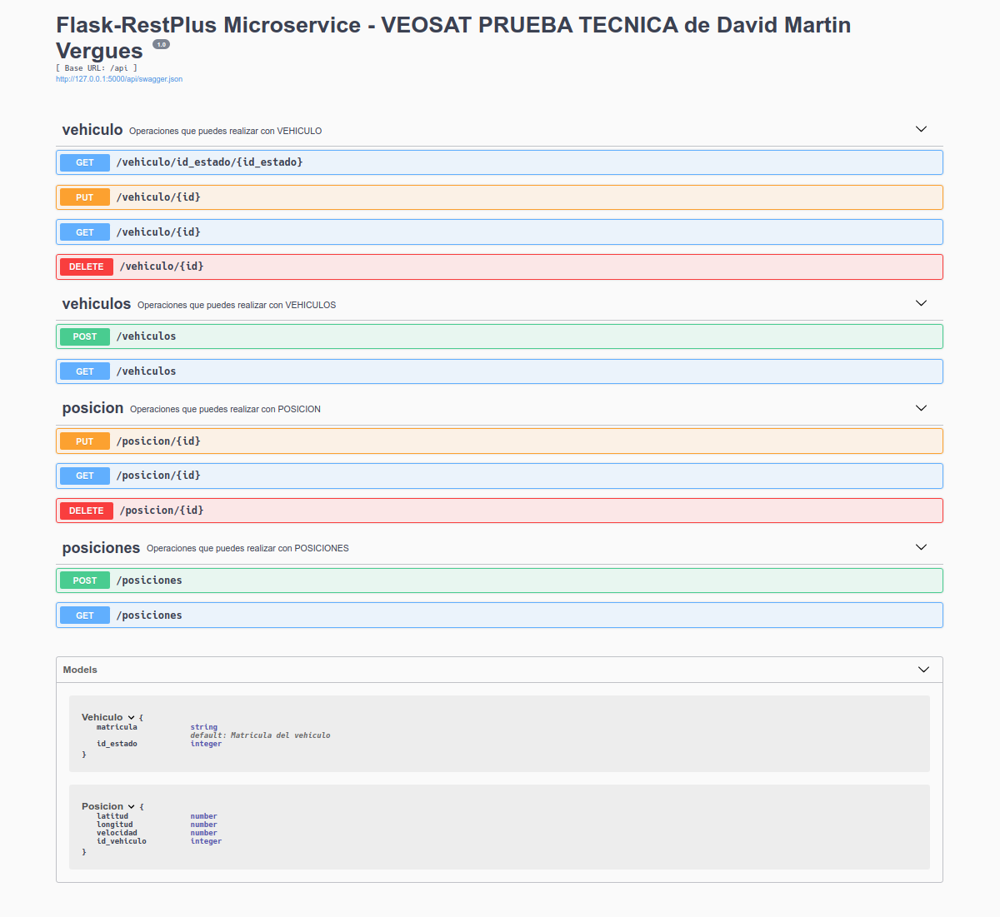

# Microservicio con Flask-RestPlus y SQLAlchemy

## Ejecución

0. Previamente ejecutar el script `veosatdb.sql` que se encuentra en el directorio raíz.

1. crear virtual environment `python3 -m ven venv_`
2. activar venv `source venv_/bin/activate`
3. intalar dependencias `pip install -r requirements.txt`
4. completar los datos de conexión en el archivo `connection_db.py`
5. correr server `python app.py`

> lo más adecuado sería guardar los datos de conexión como variables de entorno en el servidor

## Documentación API 

[API-doc](http://127.0.0.1:5000/api/doc)

## Paquetes del proyecto

1. marshmallow, ORM que me permite simplificar el proceso de serialización
2. sqlAlchemy, libreria que nos facilita la comunicación entre python y la bbdd.
3. Swagger UI, generar documentación interactiva

